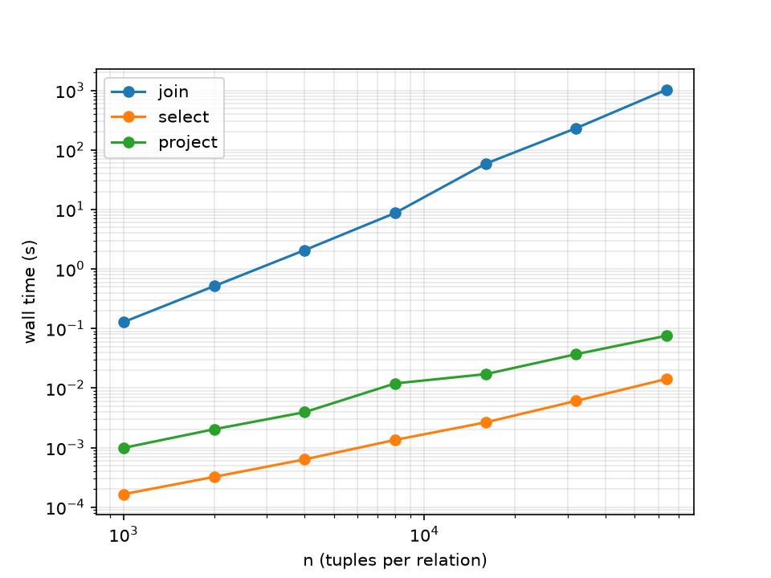

# REPORT.md: performance study

## Setup

* Machine: Intel Core i7-9750HF @ 2.60GHz, 16.0 GB RAM, Windows 10
* Language and version: Python 3.14.7
* Query: `R join[R.b=S.b] S`, data from `gen.py` (R(a, b), S(b, c), match rate 1, seed 0)
* Timing covers evaluation of the parse tree only (not parsing, data generation or printing).

## Table (join, match rate 1)

| n | m | comparisons | wall time (s) | output tuples |
|---|---|---|---|---|
| 1000 | 1000 | 1000000 | 0.128 | 974 |
| 2000 | 2000 | 4000000 | 0.515 | 1910 |
| 4000 | 4000 | 16000000 | 2.070 | 3971 |
| 8000 | 8000 | 64000000 | 8.717 | 8076 |
| 16000 | 16000 | 256000000 | 58.600 | 15988 |
| 32000 | 32000 | 1024000000 | 231.830 | 32132 |
| 64000 | 64000 | 4096000000 | 1029.717 | 63932 |

## Questions

**1. Relationship between n, m and the comparison count.**

Comparisons = n * m exactly, at every row in the table above (confirmed by the engine's own
check: "comparisons == n*m for every row: yes"). This matches the nested-loop join
implementation directly: for every one of the n tuples in R, the algorithm tests the join
condition against every one of the m tuples in S, regardless of whether earlier pairs matched.
There's no discrepancy to explain because the counter is incremented on every single pair
tested, which is exactly n*m pairs.

**2. Log-log plot of time against n.**

Slope: 2.192. Since n = m in every row, n*m = n², so an algorithm whose work is proportional
to n*m should show a slope of exactly 2 on a log-log plot of time vs n. My measured slope
(2.192) is close to 2, confirming the join's cost grows quadratically with the input size, as
expected for a nested-loop join. The slope is slightly above 2 rather than exactly 2, likely
because of fixed per-run overhead (Python interpreter startup, object allocation, garbage
collection) that doesn't scale perfectly with n, and because larger runs also spend more time
building larger output lists. The plot itself shows the join line rising noticeably steeper
than the select and project lines, which sit close to each other and much flatter — visually
confirming the quadratic-vs-linear difference discussed in question 3.

**3. Select and project at the same sizes.**

| n | select counter | select time (s) | project counter | project time (s) |
|---|---|---|---|---|
| 1000 | 1000 | 0.0002 | 1000 | 0.0010 |
| 2000 | 2000 | 0.0003 | 2000 | 0.0020 |
| 4000 | 4000 | 0.0006 | 4000 | 0.0039 |
| 8000 | 8000 | 0.0013 | 8000 | 0.0120 |
| 16000 | 16000 | 0.0027 | 16000 | 0.0171 |
| 32000 | 32000 | 0.0061 | 32000 | 0.0371 |
| 64000 | 64000 | 0.0142 | 64000 | 0.0759 |

Slopes: select ≈ 1.066, project ≈ 1.046 — both close to 1, meaning linear growth in n. This
makes sense: select and project each touch every input tuple exactly once (one pass over n
tuples), so their cost is O(n). Join, by contrast, touches every *pair* of tuples from both
inputs, giving O(n*m) = O(n²) when n = m — which is why its slope (2.192) is roughly double
theirs. Project is consistently a bit slower than select at the same n because it also builds
and deduplicates an output tuple for every input row, while select only tests a condition and
optionally keeps the row unchanged.

**4. Prediction for one million tuples per side.**

Comparisons = n*m = 1,000,000 * 1,000,000 = 1,000,000,000,000 (1e12)

Using the largest measured run (n = 64000, 4,096,000,000 comparisons, 1029.717 s):
seconds per comparison = 1029.717 / 4,096,000,000 = 2.514e-07 s

Prediction A (per-comparison rate): 1e12 * 2.514e-07 s = 2.514e5 s ≈ 2.9 days
Prediction B (from the slope): 1029.717 * (1,000,000 / 64,000)^2.192 ≈ 4.258e5 s ≈ 4.9 days

I'd trust Prediction A slightly more, since it's a direct rate extrapolation from the single
largest, most representative measured run, while Prediction B compounds any noise in the
fitted slope across a much larger exponent range. In practice the real number could be worse
than either: at one million tuples per side the output and working set no longer fit
comfortably in cache/memory the way the smaller runs did (my machine has 16 GB RAM and a
mechanical HDD alongside the SSD), so memory access patterns and potential disk paging would
likely slow things down further rather than speed them up.

**5. Does changing the match rate change the comparison count? The wall time?**

| n | match rate | comparisons | wall time (s) | output tuples |
|---|---|---|---|---|
| 4000 | 1 | 16000000 | 2.070 | 3971 |
| 4000 | 2 | 16000000 | 2.087 | 8046 |
| 4000 | 4 | 16000000 | 2.121 | 16053 |
| 4000 | 8 | 16000000 | 2.385 | 32022 |
| 4000 | 16 | 16000000 | 3.572 | 63964 |

The comparison count stays fixed at 16,000,000 regardless of match rate, because a nested-loop
join tests every pair from R and S no matter how many pairs actually satisfy the condition —
the condition still has to be *evaluated* on every pair to find out. Wall time, however,
increases with match rate (2.070s → 3.572s), because a higher match rate means more pairs pass
the condition, so more output tuples get built and appended to the result list. The comparison
count measures work done by the *condition check*; wall time also includes the cost of
*constructing and storing* every matching output row, which grows with the number of matches.

**6. What would you change to make the million-tuple join feasible?**

The bottleneck is that nested-loop join does O(n*m) work regardless of how selective the join
condition is. A hash join would instead build a hash table on the join attribute of the smaller
relation (O(n) to build) and then do a single O(m) pass over the other relation, looking up
matches directly — turning O(n*m) into roughly O(n+m). A sort-merge join would sort both
relations by the join attribute (O(n log n) and O(m log m)) and then merge them in one linear
pass. Either approach avoids ever comparing pairs that couldn't possibly match, which is exactly
the waste a nested-loop join can't avoid without an index.